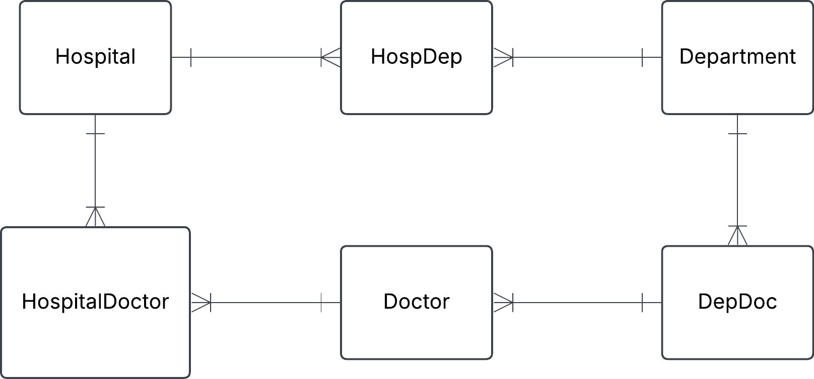
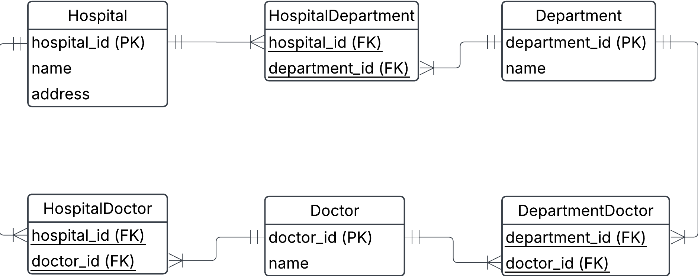

# Exercise 1 - going in to logical and physical data modeling

These exercises are for you to learn fundamental concepts in data modeling. Many of them can be done with pen and paper, physical whiteboard or with an ERD software such as Lucidchart and dbdiagram. It is good practice to work analogue as an important part of data modeling is to align various stakeholders with a mix of technical and business knowledge. It is also advised to discuss with your peers as data modeling usually is not done in solitude.

## 0. Hospital example
Going back to the hospital exercise from exercise0, task 1, we will build logical and physical data models. This is the conceptual data model after we've added the composite entities to take care of many-to-many relationships.

a) Create a logical data model using lucidcharts

b) Identify different keys on the various entities

c) Identify child entities and parent entities. What makes them into parent/child relationships?

d) Create a physical data model using dbdiagram

e) Create a few tables manually, insert given data plus some more, and try to manually link foreign keys to primary keys. Can you satisfy that a doctor can work at several departments and several hospitals?

### Solution

a) 

b)
Hospital: hospital_id (PRIMARY KEY)
Department: department_id (PRIMARY KEY)
Doctor: doctor_id (PRIMARY KEY)
HospitalDepartment: hospital_id (FOREIGN KEY), department_id (FOREIGN KEY)
composite primary key = (hospital_id, department_id)
DepartmentDoctor: department_id (FOREIGN KEY), doctor_id (FOREIGN KEY)
composite primary key = (department_id, doctor_id)
HospitalDoctor: hospital_id (FOREIGN KEY), doctor_id (FOREIGN KEY)
composite primary key = (hospital_id, doctor_id)

c)
Parent entities = Doctor, Hospital, Department
Child entities = DepartmentDoctor, HospitalDepartment, HospitalDoctor

Child entities rely on parent entities, all, or part of their attributes come from the parent entity

## 1. Implement hospital example in postgres
a) Now implement your physical model from e) and add the data from task 0e). Make sure that you have correctly specified different domain constraints.

b) Now lets try to add a row in HospitalDepartment with a hospital_id that doesn't exist in the hospital table. What happens here and why?

c) Do similar to b) but try adding a department_id to HospitalDepartment that doesn't exist in the Department.

d) Now try to do normal delete a record in Hospital that the HospitalDepartment refers to. What happens?

e) Now use delete on cascade and check what happens.

f) Try to violate a domain constraint, what did you try and what result did you get?