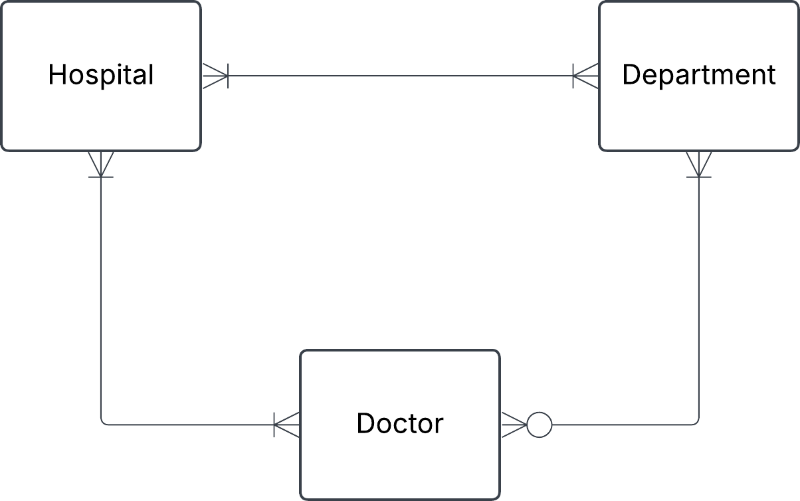

# Exercise 0

## 1. Hospital task


You have this json data, convert it into three tables: Hospital, Department and Doctor. Fill these tables with data. Do this manually and not programmatically.

```json
{
  "hospital": "Sjukhusstock",
  "address": "Drottninggatan 3, Stockholm",
  "departments": [
    {
      "name": "Kardiologi",
      "doctors": [
        { "id": 1, "name": "Dr. Abra Abrahamson" },
        { "id": 2, "name": "Dr. Erika Eriksson" }
      ]
    },
    {
      "name": "Neurologi",
      "doctors": [{ "id": 3, "name": "Dr. Sven Svensson" }]
    }
  ]
}
```

### Solution


- identify entities
- identify relationships and cardinalities
- create conceptual ERD
- create tables

**Initial naive conceptual ERD**



**Initial tables**

Hospital

|hospital_id|name        |address         |
|-----------|------------|----------------|
|1          |sjukhusstock|drottninggatan3 |
|2          |löwenströmsk|löwetvägen1     | # lagt till själv

Department

|department_id|name        |
|-------------|------------|
|1            |Kardiologi  |
|2            |Neurologi   |
|3            |Paliativ avd| # lagt till själv

Doctor

|doctor_id    |name                  |
|-------------|----------------------|
|1            |Dr. Abra Abrahamsson  |
|2            |Dr. Erika Eriksson    |
|3            |Dr. Sven Svensson     |
|4            |Dr. Alex Alexandersson|

refined with bridge tables to reflect many-to-many relatonships


HospitalDepartment

|hospital_departmen_id|hospital_id|department_id|
|---------------------|-----------|-------------|
|1                    |1          |1            |
|2                    |1          |2            |
|3                    |2          |2            | # gjort själv
|4                    |2          |3            | # gjort själv


HospitalDoctor # gjort själv

|hospital_doctor_id|hospital_id|doctor_id|
|------------------|-----------|---------|
|1                 |1          |1        |
|2                 |1          |2        |
|3                 |1          |3        | 
|4                 |2          |4        | # gjort själv
|5                 |1          |4        | # gjort själv


DepartmentDoctor # gjort själv

|department_doctor_id|department_id|doctor_id|
|--------------------|-------------|---------|
|1                   |1            |1        |
|2                   |1            |2        |
|3                   |2            |3        |
|4                   |2            |4        | # gjort själv
|5                   |3            |4        | # gjort själv


Test a join
Want information on Sjukhusstock and its departments
- hospital_department can join with department_id and can join with department_id on department table and hospital_id on hospital_table
- query name from hospital table and name from department table

TODO: left for reader create this SQL query