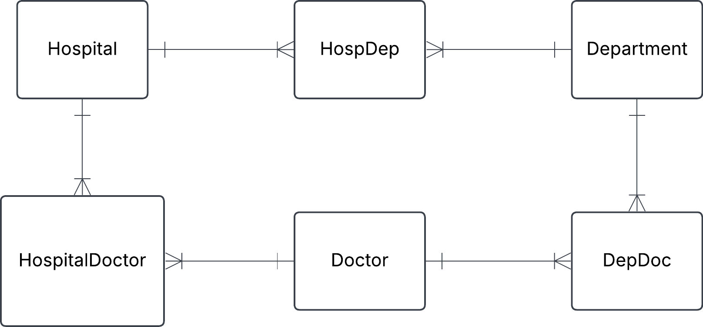
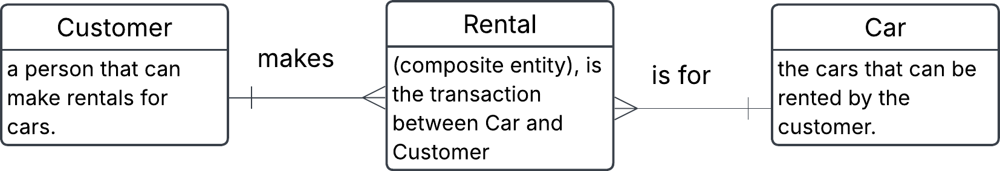
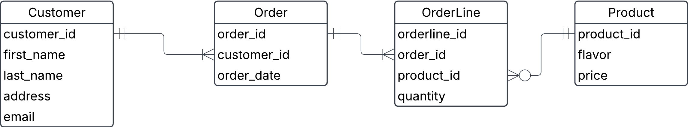
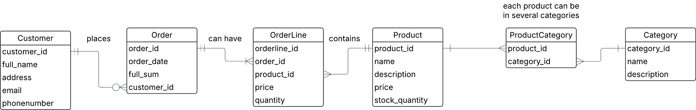

# Exercise 0

## 1. Hospital task


You have this json data, convert it into three tables: Hospital, Department and Doctor. Fill these tables with data. Do this manually and not programmatically.

```json
{
  "hospital": "Sjukhusstock",
  "address": "Drottninggatan 3, Stockholm",
  "departments": [
    {
      "name": "Kardiologi",
      "doctors": [
        { "id": 1, "name": "Dr. Abra Abrahamson" },
        { "id": 2, "name": "Dr. Erika Eriksson" }
      ]
    },
    {
      "name": "Neurologi",
      "doctors": [{ "id": 3, "name": "Dr. Sven Svensson" }]
    }
  ]
}
```

### Solution


- identify entities
- identify relationships and cardinalities
- create conceptual ERD
- create tables

**Initial naive conceptual ERD**


**Initial tables**

Hospital

|hospital_id|name        |address         |
|-----------|------------|----------------|
|1          |sjukhusstock|drottninggatan3 |
|2          |löwenströmsk|löwetvägen1     | # lagt till själv

Department

|department_id|name        |
|-------------|------------|
|1            |Kardiologi  |
|2            |Neurologi   |
|3            |Paliativ avd| # lagt till själv

Doctor

|doctor_id    |name                  |
|-------------|----------------------|
|1            |Dr. Abra Abrahamsson  |
|2            |Dr. Erika Eriksson    |
|3            |Dr. Sven Svensson     |
|4            |Dr. Alex Alexandersson|

refined with bridge tables to reflect many-to-many relatonships



HospitalDepartment

|hospital_departmen_id|hospital_id|department_id|
|---------------------|-----------|-------------|
|1                    |1          |1            |
|2                    |1          |2            |
|3                    |2          |2            | # gjort själv
|4                    |2          |3            | # gjort själv


HospitalDoctor # gjort själv

|hospital_doctor_id|hospital_id|doctor_id|
|------------------|-----------|---------|
|1                 |1          |1        |
|2                 |1          |2        |
|3                 |1          |3        | 
|4                 |2          |4        | # gjort själv
|5                 |1          |4        | # gjort själv


DepartmentDoctor # gjort själv

|department_doctor_id|department_id|doctor_id|
|--------------------|-------------|---------|
|1                   |1            |1        |
|2                   |1            |2        |
|3                   |2            |3        |
|4                   |2            |4        | # gjort själv
|5                   |3            |4        | # gjort själv


Test a join
Want information on Sjukhusstock and its departments
- hospital_department can join with department_id and can join with department_id on department table and hospital_id on hospital_table
- query name from hospital table and name from department table

TODO: left for reader create this SQL query = DONE!

---

## 2. Library Bookly
A library called Bookly keeps track of books and members who borrow them. Each book has a title, author, and ISBN number. Each member has a membership ID, name, and contact information. A member can borrow multiple books, but each book can be borrowed by only one member at a time.

a) Identify the entities and attributes for each entity.

b) Determine the relationship between member and books.

c) Draw a conceptual ERD using crow foots notation.

### Solution

a) Entities: 

- **Book**
  - ISBN # natural key
  - name
  - title
  - author

>[!NOTE]
> ISBN is a unique number for a book, which can be used as a ``primary key`` this will make it into a ``natural key``

- **Member**
  - membership_id # natural key
  - first_name
  - last_name
  - phone
  - address
  - email

**Borrowing**
  - borrowing_id
  - ISBN
  - membership_id
  - return_date
  - borrow_date

b)
- A member can have zero or several Borrowings
- A Borrowing can be made by one and only one Member
- A Borrowing is linked to one and only one Book
- A Book can be in zero or more Borrowings

c)

Initial conceptual ERD

<br>

Replaced many to many with a bridge table (composite entity)


## 3. Car rental
Conceptual ERD to words.

This is an ERD conceptual diagram that a database designer and the business stakeholders agreed upon in a car rental company called Carent.


a) Describe the entities in this conceptual ERD.

b) Write out the relationship labels.

c) Describe the relationships between the entities (one-to-many, one-to-one and many-to-many).

d) Define the relationship statement for example: "A Customer can have one or more Rentals".

### Solutions

a) 
- Customer, is a person that can make rentals for cars.
- Car, is the cars that can be rented by the customer. 
- Rental (composite entity), is the transaction between Car and Customer


Alternative to put in the descriptions into the entities directly in conceptual ERD:


b) see image above

c) 
  - Customer to rental (one-to-many)
  - Rental to Customer (many-to-one)
  - Rental to Car (many-to-one)
  - Car to Rental (one-to-many)

d)

- Customer makes one or more Rentals
- Each Rental is connected to one Customer
- Each Rental is for one Car
- Each Car can be in several Rentals

## 4. Online store
You are designing a database for an online store that sells multiple products. Customers can place multiple orders, and each order contains multiple products.

a) Identify entities and their relationships

b) Create a conceptual ERD with cardinalities

### Solution:

a) Entities:
  - Customer
  - Order
  - OrderLine -  (Composite entity)
  - Product

  Relationships:
  - Customer places one or many Orders
  - Orders belong to one Customer
  - Orders contain one or many Orderlines
  - Orderlines belong to one Order
  - Orderline belongs has one Product
  - Products can be in many Orderlines

b)
  


## 5. University management system
A university needs a system to manage students, courses, and professors.

each student can enroll in multiple courses.
each course is taught by one professor.
a teacher can teach multiple courses.
a) Identify entities and their relationships

b) Come up with possible attributes for the entities

c) Draw conceptual ERD with cardinalities

d) Define business rules (e.g. a student can enroll in max 4 courses)

### Solution

a) 
Entities:
  - Student
  - Enrollment
  - Course
  - Professor

Relationships:
  - Student has Enrollments
  - Each Enrollment is made up of one Student
  - Each Enrollment is in one Course
  - A Course can be in several Enrollments
  - Each Course has one Professor
  - A Professor can hold several courses


b)
Student attributes:
  - Student ID (Primary)
  - Name
  - Address
  - Contact info

Enrollment attributes:
  - Student_id (foreign key)
  - Course_id (foreign key)

Course attributes:
  - course_id (Primary)
  - name
  - start_date
  - end_date
  - professor_id (foreign key)

Professor attributes:
  - professor_id (primary)
  - name
  - email

  c)

  

  d)


## 6. Onshop
An e-commerce platform Onshop manages customers, orders, and products.

a customer can place multiple orders.
each order contains multiple products.
a product can belong to multiple categories.
a) Identify key entities and their attributes (e.g., customer_name, order_date)

b) Sketch the conceptual ERD.

c) Define business rules

### Solution

a)
Entities:
  - Customer
  - OrderLine
  - Order
  - Product
  - ProductCategory
  - Category

Customer attributes:
  - customer_id (primary)
  - name
  - address
  - email
  - phone_number

OrderLine attributes:
  - orderline_id (primary)
  - order_id (foreign)
  - product_id (foreign key)
  - quantity
  - price (priset vid ordertillfället, eftersom pris kan ändras)

Order attributes:
  - order_id (primary)
  - customer_id (foreign)
  - order_date
  - total_sum  

Product attributes:
  - product_id (primary)
  - name
  - description
  - price
  - stock_quantity
  
ProductCategory attribues:
  - product_id (foreign)
  - category_id (foreign)

Category attributes:
  - category_id (primary)
  - name
  - description

b)

drew a logical model instead:


## 7. Theoretical questions

a) 
### What is a conceptual data model, and why is it important?
A conceptual data model is a high-level representation of the data and its relationships within a system. It focuses on the business requirements and defines the entities, attributes, and relationships without considering technical details like database implementation.

Importance:

- Provides a clear understanding of the data requirements for stakeholders.
- Serves as a blueprint for creating logical and physical data models.
- Helps identify key entities and their relationships early in the design process.

b) 
### Storing age in a database, is that a good idea, why?
Storing age in a database is generally not a good idea because age is a dynamic value that changes over time. Instead, it is better to store the date of birth (DOB) and calculate the age when needed.

Reasons:

- Data accuracy: Age becomes outdated unless updated regularly.
- Efficiency: Storing DOB allows for more flexible queries (e.g., calculating age ranges).
- Consistency: DOB is a static value, ensuring data integrity.

c) 
### What are the three types of data structures, and how do they differ?
The three main types of data structures are:

- Linear Data Structures:
Data is organized sequentially.
Examples: Arrays, Linked Lists, Stacks, Queues.
Difference: Easy to traverse but less efficient for complex relationships.
- Hierarchical Data Structures:
Data is organized in a tree-like structure.
Examples: Trees, Binary Search Trees, Heaps.
Difference: Efficient for representing parent-child relationships.
- Graph Data Structures:
Data is organized as nodes (vertices) connected by edges.
Examples: Social networks, road maps.
Difference: Best for representing complex relationships like many-to-many.

d) 
### Give examples of how each data structure is used in real-world applications
- Linear Data Structures:
  - Arrays: Storing a list of items like product IDs in an e-commerce platform.
  - Queues: Managing tasks in a printer queue.
- Hierarchical Data Structures:
  - Trees: Representing file systems (folders and subfolders).
  - Heaps: Implementing priority queues in scheduling systems.
- Graph Data Structures:
  - Social Networks: Representing users as nodes and friendships as edges.
  - Navigation Systems: Representing cities as nodes and roads as edges.

e) 
### What is cardinality in data modeling, and why is it important?
Cardinality refers to the number of instances of one entity that can be associated with instances of another entity in a relationship.

Types:

- One-to-One (1:1): A person has one passport.
- One-to-Many (1:N): A customer can place multiple orders.
- Many-to-Many (M:N): Students can enroll in multiple courses, and courses can have multiple students.

Importance:

Ensures accurate representation of relationships.
Helps in designing efficient database schemas.
Prevents data redundancy and ensures data integrity.

f)
### What are the different steps of data modeling?
- Conceptual Data Modeling:
  - Identify entities, attributes, and relationships.
  - Focus on business requirements.
- Logical Data Modeling:
  - Define the structure of the data (e.g., tables, columns, keys).
  - Normalize the data to reduce redundancy.
- Physical Data Modeling:
  - Implement the logical model in a specific database system.
  - Optimize for performance (e.g., indexing, partitioning).

g) 
### What factors influence the choice between using an RDBMS and NoSQL?
- Data Structure:
  - RDBMS: Best for structured data with predefined schemas.
   -NoSQL: Suitable for unstructured or semi-structured data.
- Scalability:
  - RDBMS: Vertical scaling (adding more resources to a single server).
  - NoSQL: Horizontal scaling (adding more servers).
- Flexibility:
  - RDBMS: Rigid schema, ideal for consistent data.
  - NoSQL: Flexible schema, ideal for dynamic or evolving data.
- Use Case:
  - RDBMS: Financial systems, inventory management.
  - NoSQL: Social media, IoT, real-time analytics.
- Consistency vs. Availability:
  - RDBMS: Prioritizes consistency (ACID compliance).
  - NoSQL: Prioritizes availability and partition tolerance (CAP theorem).


Glossary

- RDBMS	Relational Database Management System; uses tables to store structured data.
- Relational Model	A model that organizes data into tables with rows and columns.
- Conceptual Model	High-level representation of data focusing on business requirements.
- Logical Model	Detailed structure of data, including tables, attributes, and relationships.
- Physical Model	Implementation of the logical model in a database system.
- ERD	Entity-Relationship Diagram; visual representation of entities and relationships.
- Data Modeling	Process of defining and organizing data structures and relationships.
- Data Integrity	Ensuring data is accurate, consistent, and reliable.
- Data Consistency	Ensuring data remains uniform across the database.
- Field	A single piece of data in a table (e.g., a column).
- Attribute	A property or characteristic of an entity (e.g., name, age).
- Data Type	Defines the type of data (e.g., integer, string).
- Tuple	A single row in a table.
- Data Redundancy	Duplication of data, which can lead to inconsistencies.
- Transaction	A sequence of operations performed as a single logical unit of work.
- Cardinality	Defines the number of relationships between entities.
- One-to-One	Each instance of an entity is related to one instance of another entity.
- One-to-Many	One instance of an entity is related to many instances of another entity.