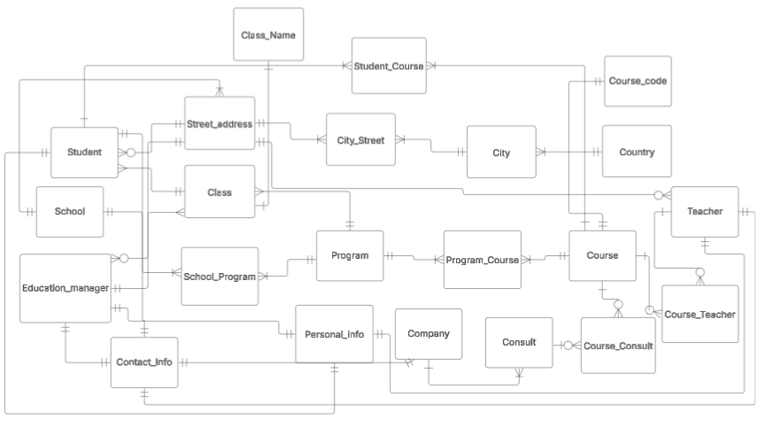

# Uppgift 0

## Requirements:
### a) Skapa ett folder i ditt repo som du kallar för yh_labb.
### b) Gör en konceptuell modell baserat på kravspecifikationen.
### c) Skriv relationship statements för varje entitet.
### d) Bygg nu en logisk modell baserat på den konceptuella
### e) Skapa fysisk modell baserat på den logiska modellen
### f) Argumentera för att modellen du skapar uppnår 3NF

## Solutions:
### a) Done
## b)

## c)
- Student has a Street_address, a Street_address can have several students.
- A Street_address can be in several City, a City has several Streer_address (Many to many relationship handled with junctiontable City_Street)
- A City belongs to one and only one Country, a Country has several city (A city can be in several Countries (the City name) but in this case we only do Sweden)
- A Student attends one and only one School at a time (business rule), a School has several Student
- A Student attends one and only one class (Business rule), a Class has several Student
- A Class belongs to one and only one Program, a Program has several Class
- A School can 