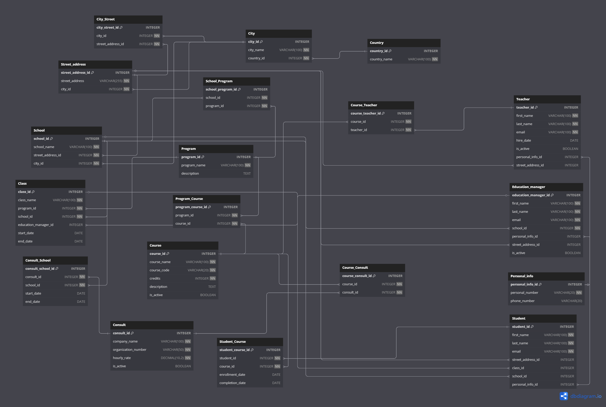

# Uppgift 0

## Requirements:
### a) Skapa ett folder i ditt repo som du kallar för yh_labb.
### b) Gör en konceptuell modell baserat på kravspecifikationen.
### c) Skriv relationship statements för varje entitet.
### d) Bygg nu en logisk modell baserat på den konceptuella
### e) Skapa fysisk modell baserat på den logiska modellen
### f) Argumentera för att modellen du skapar uppnår 3NF

## Solutions:
### a) Done
## b)

## c)
- Student has a street address, a street address can have several students.
- A street address can be in several Cities, a City has several street addresses (Many to many relationship handled with junctiontable City_Street)
- A City belongs to one and only one Country, a Country has several cities (A city can be in several Countries (the City name) but in this case we only do Sweden)
- A Student attends one and only one School at a time (business rule), a School has several Students
- A Student attends one and only one class (Business rule), a Class has several Students
- A Class belongs to one and only one Program, a Program has several Classes
- A School can have multiple street addresses, a street address has only one school (YrkesCo don't have multiple schools on one street address)
- A School has one or many Education managers, an education manager works in only one school (they don't work in both Stockholm and Gothenburg)
- A School has at least one class, a class belongs to only one school
- A school has several programs, a program can be taught in several schools (many to many relationship handled by junctiontable School_Program)
- A School can have zero or several consultants, a consultant can work in zero or several schools (many to many handled by junctiontable Consult_School)
- A Program has several courses, a course can be in several programs (many to many handled by junctiontable Program_Course)
- A Course is taught by one or many Consultants, a consultant can be teaching zero or several courses (many-to-many handled by junctiontable Course_Consult)
- A Student can be in one or several courses (courses not part of a program), a course can have one or many students (many to many handled by junctiontable Student_Course)
- A Course is taught by one or many teachers (if zero, it's taught by a Consultant instead), a Teacher can teach zero or several courses (many-to-many handled by Course_Teacher)
- Person_info has a one-to-one relationship with Teacher, Ecucation_manager and Student
- A Teacher works at one and only one school, a School has zero or many teachers
- An Education manager can work at one and only one School, a School has zero or several Education managers
- An Education manager has one and only one streetaddress, a streetaddress can have zero or many education managers
- A Teacher have one and only one streetaddress, a streetaddress can have zero or several teachers
- A School can ben be in one-or-many cities, a City can only have one yrkesco School (Business rule)

## d)

## e)

or see dmbl file